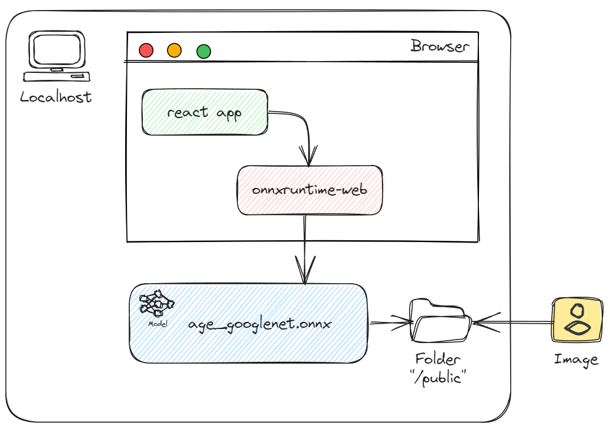
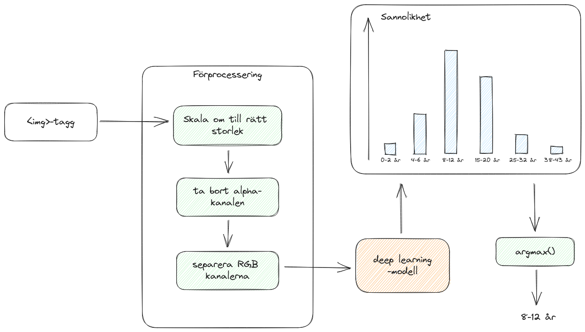
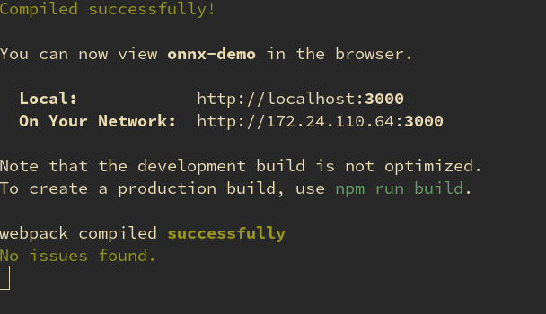
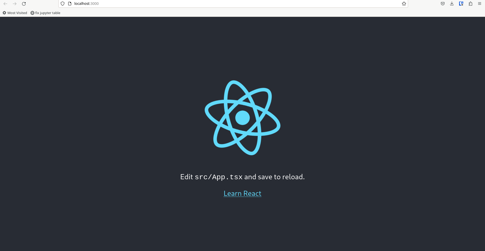
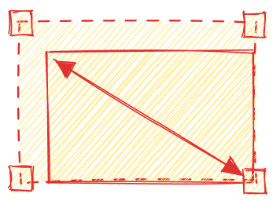
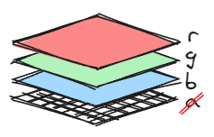
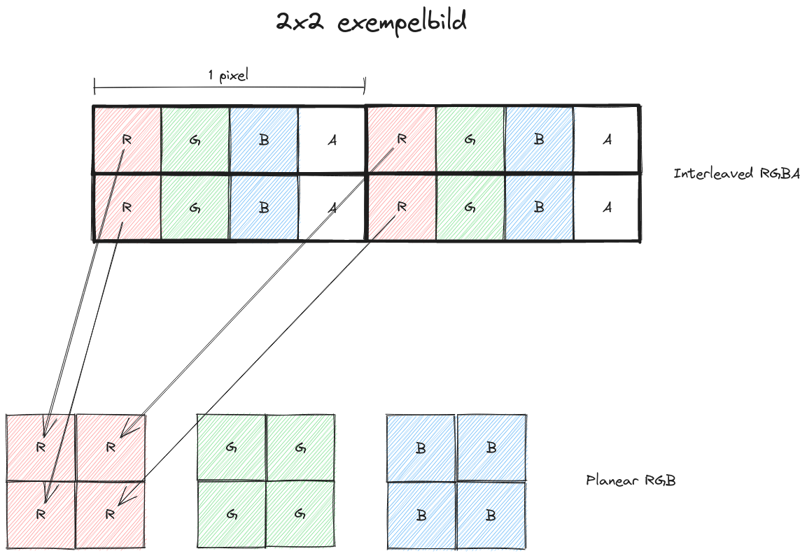
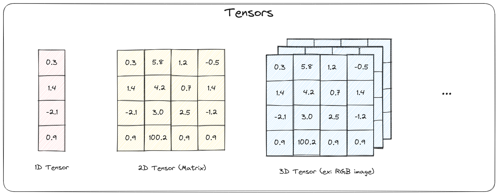
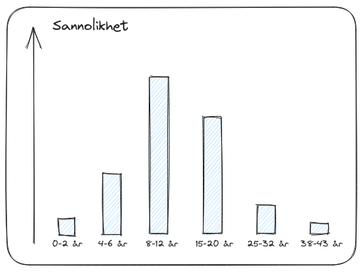
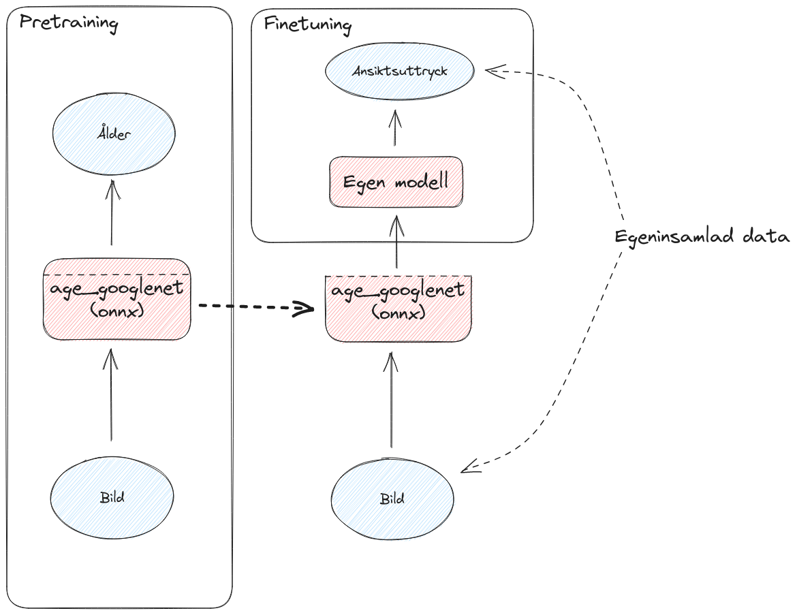

# Målbild
I den här labben är tanken att vi ska bygga ett system för att estimera ålder från en bild.
Vi kommer att göra detta direkt i webbläsaren med hjälp av ett ramverk som heter `onnxruntime-web`.
Det låter oss utföra inferens med en deep learning-modell som har förtränats för att estimera ålder. 

<!--  -->

<br/>
Den största delen av labben kommer att gå ut på att manipulera indatabilden i ett förprocesseringssteg.
Eftersom modellen vi använder har blivit tränat på en viss typ av bilder (storlek, pixelintensitet, bildformat, motivets position, etc)
är det extremt viktigt att se till att den data vi skickar in matchar detta så nära som det går. 
Annars kan vi inte räkna med att få ett korrekt resultat från modellen.
Det framgår lite tydligare i bilden nedan att förprocesseringen är den största delen av labben.

<br/>
<br/>

<!--  -->

<!--  -->

<br/>
När vi är klara med förprocesseringen deserialiserar vi modellen, anropar den med vår indata och presenterar resultatet.

# Förberedelser
1. Installera npm
2. Kör `npm install -g npx` för att installera npx
3. Hitta och ladda ner en testbild på en person du vill åldersbestämma.
4. Hämta den färdigtränade modellen från [https://github.com/onnx/models/blob/main/vision/body_analysis/age_gender/models/age_googlenet.onnx](https://github.com/onnx/models/blob/main/vision/body_analysis/age_gender/models/age_googlenet.onnx)

# Ett enkelt UI
Vi börjar med att skapa ett nytt react-typescript projekt och går in i det.

```bash
npx create-react-app onnx-demo --template typescript
cd onnx-demo
```

Vi testar att projektet sattes upp ordentligt genom att starta development-servern som följer med 
react projektet.

```bash
npm start
```

Om allt fungerar som det ska, startar development-servern och en ny flik att öppnas i din webbläsare 
med ett exempelprojekt som skapades av `create-react-app`.
Avsluta development-servern med `Ctrl-c`.





För att köra en maskininlärningsmodell i webbläsaren kommer vi att behöva ett javascriptbibliotek som heter `onnxruntime-web`.
Biblioteket används för att deserialisera och köra `.onnx` modeller som är ett vanligt filformat för att spara just färdigtränade modeller.

Vi använder npm för att installera biblioteket lokalt till det här projektet:
```bash
npm install onnxruntime-web
```

Vi måste nu kopiera vår exempelbild och `.onnx` modellen som vi hämtade i förberedelse-steget till `public/example_image.jpg` respektive `public/age_googlenet.onnx`.
Detta gör att development-servern automatiskt servar dessa filer statiskt.

Vi börjar med ett enkelt UI med en rubrik, bilden som vi vill applicera modellen på samt en knapp för att köra modellen.
Vi öppnar filen `src/App.tsx` och byter ut innehållet med:
```react-typescript
import { InferenceSession, Tensor } from "onnxruntime-web";
import { useRef, useState } from "react";

function App() {
  return (
    <div>
      <h1>Age Estimator</h1>
      
      <br/>
      <button id="estimate_age" type="button"> Estimate Age </button>
    </div>
  );
}

export default App;
```
De två första raderna importerar funktioner som vi kommer att behöva framöver.
För att komma åt bilden programmatiskt använder vi en så kallad ref-hook, ett reactkonstrukt som låter oss referera till bilden ifrån komponentens kod.
Vi måste också sätta `crossOrigin` attributet på bildtaggen för att få webbläsaren att ge oss tillgång till bildens underliggande pixeldata.

Som första rad i `App()`-funktionen lägger vi till
```typescript
const input_image = useRef<HTMLImageElement>(null);
```

`` taggen blir nu istället
```

```
# Förprocessering av indata-bilden

<!--  -->
<!--  -->
<!--  -->

Modellen som vi kommer att köra förväntar sig ett visst format på indatan för att generera korrekta estimeringar.
Mer specifikt måste vi:
1. Skala om bilden till 224x224 pixlar.
2. Plocka ut bilddatan som en array av pixlar (av typen Uint8ClampedArray).
3. Ta bort alpha kanalen som representerar pixlarnas transparens.
4. Konvertera bilden till en array av flyttal (Float32Array).
5. Konvertera bilden från  "interleaved"-rgb format till "planar"-rgb format. I interleaved formatet är pixeldatan strukturerad så att var tredje element tillhör samma kanal. En 2x2 bild har alltså den underliggande datastrukturen
`RGBRGBRGBRGB`. Vi måste konvertera formatet så att varje kanal ligger för sig. För 2x2 exemplet blir det alltså `RRRRGGGGBBBB`. 
6. Subtrahera en normaliseringskonstant från varje pixel för att matcha formatet som modellen tränades med. I vårt fall måste vi subtrahera varje pixelintensitet med `120`. När modellen som vi använder oss av tränades, normaliserades indatabilderna genom att subtrahera medelvärdet av pixelintensiteten innan träningen skedde. Detta är ett vanligt steg när man tränar modeller och görs för att stabilisera träningsprocessen. Om du är intresserad av varför detta är nödvändigt rekommenderar jag att läsa igenom den [här](https://scikit-learn.org/stable/auto_examples/preprocessing/plot_scaling_importance.html#importance-of-feature-scaling) artikeln. Den är en del av dokumentationen till det populära maskininlärningsbiblioteket scikit-learn. Över lag är de väldigt duktiga på att förklara koncept kring maskininlärning i sin dokumentation. I vårt fall finns det beskrivet i modellens dokumentation hur datan har förprocesserats innan träning. [https://github.com/onnx/models/tree/main/vision/body_analysis/age_gender](https://github.com/onnx/models/tree/main/vision/body_analysis/age_gender).

Slutresultatet av denna förprocessering kommer att vara en array av typen Float32Array med storleken `3 * 224 * 224 = 150528` med pixlarna representerade i planarformat. 

Skillnaden mellan interleaved RGBA och planar RGB illustreras tydligast genom ett exempel.
Här tänker vi oss att vi har en 2x2 pixlar bild som ska konverteras från RGBA interleaved till RGB planar:

Slutresultatet är alltså att alla kanaler lagras för sig i röd-grön-blå ordning.
Notera att vi ignorerar alphakanalen som innehåller information om hur genomskinlig pixeln är.
I vårt fall bryr vi oss inte om transparensen och modellen som vi använder förväntar sig endast RGB kanaler, ingen alphakanal.

Vi gör allt detta i en `preprocess` funktion som körs när bilden laddas:
```typescript
  // Från modellens dokumentation (https://github.com/onnx/models/tree/main/vision/body_analysis/age_gender)
  const TRAINING_INPUT_DATA_MEAN = 120.0; 
  const INPUT_WIDTH = 224;
  const INPUT_HEIGHT = 224;

  const [preprocessed, set_preprocessed] = useState<Float32Array>();
  const preprocess = () => {
    const canvas = document.createElement("canvas");

    const img_w = input_image.current!.width;
    const img_h = input_image.current!.height;
    canvas.width = INPUT_WIDTH;
    canvas.height = INPUT_HEIGHT;

    // 1. Skala om bilden till 224x224
    const ctx = canvas.getContext("2d")!;
    ctx.drawImage(input_image.current!, 0, 0, img_w, img_h, 0, 0, INPUT_WIDTH, INPUT_HEIGHT);

    // 2. Plocka ut pixeldatan från vårt canvas-element
    const array = ctx.getImageData(0, 0, canvas.width, canvas.height).data;

    // 3. Ta bort alphakanalen
    const without_alpha = remove_alpha(array);

    // 4. och 5. Konvertera till flyttalsarray och subtrahera medelvärdet av träningsdatan
    const f32array = Float32Array.from(without_alpha, x => x - TRAINING_INPUT_DATA_MEAN);

    // 6. Konvertera till planar-format
    const channel_separated = interleaved_to_planear(f32array);

    set_preprocessed(channel_separated);
  }
  ...
  
```
Vi går igenom funktionen en sak i taget:
Först skapar vi en canvas och ritar bilden - skalad - på canvasen för att kunna läsa ut pixeldatan med `getImageData`. 

Sedan använder vi funktionen `remove_alpha()` för att skapa en ny array med samma pixelar men utan sin alphakanal.

Därefter måste vi konvertera datan från en array av typen `Uint8ClampedArray` som är en array med 8-bitarselement till en `Float32Array` med flyttal som modellen accepterar. I samma veva subtraherar vi `120.0` från varje pixel för att matcha träningsdatan.

Vi konverterar från interleaved till planar med `interleaved_to_planear()` funktionen som vi implementerar nedan. 

Sist men inte minst sparar vi resultatet i komponentens state via `set_preprocessed()`.

På sista raden modifierar vi img-taggen så att `preprocess` körs när bilden laddas.

Vi måste nu implementera funktionerna `remove_alpha()` och `interleaved_to_planear()`. 
Detta gör vi som globala funktioner (utanför `App()`):
```typescript
/*
 * Remove the alpha channel from an interleaved RGBA imagedata array.
 */
const remove_alpha = (array: Uint8ClampedArray) => {
  const result = new Uint8ClampedArray(array.length / 4 * 3);
  for (let i = 0; i < array.length; i += 4) {
    result[i / 4 * 3 + 0] = array[i + 0]; // R
    result[i / 4 * 3 + 1] = array[i + 1]; // G
    result[i / 4 * 3 + 2] = array[i + 2]; // B
  }
  return result;
}

/* 
 * Convert from interleaved RGB to planar RGB.
 */
const interleaved_to_planear = (array: Float32Array) => {
  const plane_size = array.length / 3;
  const result = new Float32Array(array.length);
  for (let i = 0; i < plane_size; i++) {
    result[i + plane_size * 0] = array[i * 3 + 0];
    result[i + plane_size * 1] = array[i * 3 + 1];
    result[i + plane_size * 2] = array[i * 3 + 2];
  }
  return result;
}
```
Båda funktionerna itererar helt enkelt igenom alla pixlar i arrayen och sparar i en ny array med den önskade strukturen.

# Använda modellen (Inferens)
Nu har vi äntligen kommit så långt att vi kan anropa modellen med vår bild. Detta steg kallas för inferens och går ut på att skicka vår förprocesserade data till modellen och få ut ett resultat.

I det här steget kommer vi att:
1. Deserialisera en färdigtränad modell från vår `age_googlenet.onnx` fil som innehåller den färdigtränade modellens vikter.
2. Skapa en Tensor från vår indata med rätt dimensioner.
3. Applicera modellen på den skapade tensorn.

## Vad är en Tensor?

Många maskininlärningsmodeller opererar på instanser av datatyper som kallas tensorer. 
Ordet kommer från matematiken och är en generalisering av en sorts generalisering av en vektor.
I praktiken, i AI/ML sammanhang, har det kommit att betyda en flerdimensionell array som är optimerad för matrismultiplikation som är vanligt förekommande i ML algoritmer.
Ett exempel på en tvådimensionell tensor är en matris som då har de två dimensionerna: rader och kolumner.
Vår RGB bild råkar också vara en tredimensionell tensor där de tre dimensionerna i vår tensor är: bildens höjd, bredd och antal kanaler.

## Inferens
Vi vill göra åldersestimeringen när användaren trycker på "Estimate Age"-knappen.
Därför skapar vi en ny funktion och lägger till den som handler till knappens `onClick` event.
```typescript 
const estimate_age = async () => {}
...
    <button id="estimate_age" type="button" onClick={estimate_age}> Estimate Age </button>
```
Vi markerar funktionen med `async` för att kunna använda `await` för att vänta på deserialiseringen och körningen av modellen med onnxruntime som är asynkrona anrop.

Det första vi vill göra i `estimate_age` är att deserialisera modellen. Detta gör vi med ett anrop till `InferenceSession.create(..)`:
```typescript 
const model = await InferenceSession.create('age_googlenet.onnx', { executionProviders: ['webgl']});
```
När vi skapar en `InferenceSession` måste vi specificera en eller flera så kallade `executionProviders`. Här har vi några olika alternativ som representerar vilken backend onnx kommer att använda för att snabba upp inferensen. Onnx stödjer flera backends, bland annat `wasm` för icke-accelererad inferens och `webgl` som använder opengls webbimplementation för att accelerera inferensen. För att utnyttja GPU acceleration när vi anropar modellen använder vi `webgl` som vår `executionProvider`.

Nästa steg är att skapa en tensor från vår indata. Eftersom vi har representerat bilden som en vanlig array av flyttal måste vi inkludera informationen om tensorns dimensioner när vi skapar den.
```typescript
const tensor = new Tensor(preprocessed!, [1, 3, INPUT_HEIGHT, INPUT_WIDTH]);
```
Den första ettan i det andra argumentet kan verka lite underlig, men den representerar faktumet att vi endast vill utföra estimeringen på en bild och inte en lista med bilder. Trean representerar tre kanalerna R, G och B och de två sista elementen i listan är y respektive x dimensionerna i bilden. Vi har med andra ord en 4D-tensor där den första dimensionen är antalet bilder vi vill utföra inferens på.

Nu kan vi applicera modellen på tensorn och få ut ett resultat:
```typescript 
const results = await model.run({input: tensor});
const output = results['loss3/loss3_Y'].data;
console.log(output);
```
`loss3/loss3_Y` är en referens till utdatalagret i modellfilen och motsvarar en output för modellen. Om du använder andra modeller måste du se till att du 
specificerar rätt output här. Ett enkelt sätt att ta reda på namnet på utdatalagret är att köra `console.log(results)` och se vad utdatan har för namngivna lager.
Ofta finns det bara ett namngivet lager, och det brukar då vara just det utdatalagret som man är ute efter. Annars brukar det gå att leta fram i dokumentationen för modellen och i värsta fall får man leta fram det i källkoden för träningsprogrammet.

Om vi nu testar att köra projektet med `npm start` och klickar på "Estimate Age" så ska vi om allt har gått rätt få ut en lista med flyttal
i webbläsarens utvecklingsterminal. I mitt fall får jag ut:


Det exakta resultatet du får ut beror på vilken bild du har valt att åldersestimera.

## Tolkning av utdatan
Något som kan verka konstigt är att en modell som estimerar ålder svarar med en lista istället för bara ett tal.
Förklaringen till det är att modellen inte är helt säker i sin estimering, utan svarar med en sannolikhetsdistribution över åldersintervallen.
Detta är ett resultat av hur modellen är tränad. I vårt fall har modellen tränats att klassificera bilden till ett av åtta åldersintervall.
Då kommer modellen att returnera en lista med sannolikheter för de olika intervallen.

Detta är en vanligt mönster med maskininlärningsmodeller. 
Istället för att direkt returnera ett svar får man ut sannolikheter eller *scores* för de olika *möjliga* svaren.
Det är viktigt att poängtera att även om man ofta benämner dessa *scores* som en sannolikheter, så är det egentligen bara modellens *estimering* av den korrekta sannolikheten. Om modellen är tränad på en annan typ av data, eller har inbyggda bias så kommer sannolikheterna inte att representera något rimligt.
Som exempel kan vi tänka oss att vi skickar en helt annan typ av bild till vår modell, till exempel en helt blank bild. Modellen kommer fortfarande att svara med sannolikheter för de 8 åldersintervallen den är tränad på, trots att det inte betyder någonting för en blank bild.

Hur vi väljer att presentera resultatet är upp till oss.
Ett sätt hade varit att rita ut sannolikheterna i ett histogram.



Man kan också tänka sig att man vill se till att bara presentera resultat när modellen är tillräckligt säker, och be användaren använda en annan bild om sannolikheten 
för något intervall inte överstiger ett visst tröskelvärde.

För att göra det enkelt för oss kommer vi att returnera det intervall som har högst sannolikhet enligt modellen utan att ta hänsyn till det egentliga sannolikhetsvärdet. Till exempel skulle vi om vi fick resultatet fån bilden presenterat intervallet 8-12 år eftersom den stapeln är högst.

# Presentation av resultatet
Nu återstår alltså att presentera resultatet för användaren. Detta kan göras på många olika sätt men vi gör det enkelt för oss själva och 
skriver ut intervallet med högst sannolikhet.
För att skriva ut ett snyggt intervall behöver vi en mappning mellan index i vår output-array och ålderintervall. 
Vi kan åstadkomma detta med en enkel lista av strängar:
```typescript
const AGE_INTERVALS = ['0-2', '4-6', '8-12', '15-20', '25-32', '38-43', '48-53', '60-100'];
```
Intervallerna är tagna från modellens dokumentationssida som innehåller [exempelkod i python](https://github.com/onnx/models/blob/main/vision/body_analysis/age_gender/levi_googlenet.py) för hur modellen kan användas.

Nu måste vi bara hitta indexet för det intervall med den högsta sannolikheten och indexera vår `AGE_INTERVALS` med detta index.
```typescript
const highest_probability_index = argmax(output as Float32Array);
const age_interval = AGE_INTERVALS[highest_probability_index];
```
Här måste vi hjälpa typescript genom att explicit kasta outputen till en Float32Array. Detta är bara för att hålla 
typescript-typcheckingen glad och inget som påverkar logiken.

Funktionen `argmax` måste vi implementera själva. Den ska returnera indexet av det element som har störst värde:
```typescript
const argmax = (array: Float32Array) => {
  let max = array[0];
  let max_index = 0;
  for (let i = 1; i < array.length; i++) {
    if (array[i] > max) {
      max = array[i];
      max_index = i;
    }
  }
  return max_index;
}
```

För att presentera resultatet sparar vi `age_interval` som ett react state och presenterar resultatet i en enkel `<label>` komponent:
```react-typescript
const [estimated_age, set_estimated_age] = useState<string>();
...
...
// I estimate_age() funktionen
set_estimated_age(age_interval);
...
...
// Efter <button> komponenten
<label>Estimated Age: {estimated_age}</label>
```
Om vi startar development-servern igen (`npm start`) och klickar på "Estimate Age" knappen igen får vi ett åldersintervall presenterat i UI:t.


# Fortsättningsideer
- Det är fullt möjligt att köra modellen på resultatet från en kameraström, eller låta användaren välja bild från sitt filsystem.
- Nu laddas och deserialiseras modellen varje gång användaren trycker på "Estimate Age". Detta är inte nödvändigt, utan det bör göras direkt när sidan laddar.
- På [https://github.com/onnx/models/tree/main](https://github.com/onnx/models/tree/main) finns en uppsjö av andra intressanta modeller i .onnx format som kan testas.
- Med bibliotek som PyTorch eller Tensorflow kan du träna egna modeller och exportera till .onnx. Dessa modeller går utmärkt att använda på samma sätt som vi gjort i det här exemplet.

## Transfer learning
Ett vanligt användningsområde för färdigtränade modeller är att utnyttja dem till något som kallas för transfer learning.
Detta innebär att man använder den färdigtränade modellen som en del i en ny modell som löser ett liknande men inte identiskt problem.
Säg till exempel att vi behöver en modell som försöker ta reda på om personen på bilden är arg eller glad.
Det man då kan göra är att träna en egen, mindre modell, med åldersestimeringsmodellens output som input.
Eftersom den ursprungliga modellen är tränad på en massa ansikten, kan vi utnyttja delar av modellens "kunskap" för vårt nya problem.
På detta sett behöver vi inte alls lika mycket träningsdata när vi tränar vår nya modell.

I praktiken brukar man inte använda den sista outputen från basmodellen (åldersmodellen) utan utdatan några lager ned i modellen.
Rationalen bakom det är att deep learning-modeller lär sig mer konkreta kunskaper i de första (undre) lagren och mer domänspecifika abstrakta kunskaper de övre.
Därför vill man ignorera de översta lagren i basmodellen som innehåller kunskap som bara är applicerbar på originalproblemet (åldersestimering), 
samtidigt som man vill utnyttja den mer generella kunskapen från de undre lagren.



# Slutsats


# Hela källkoden för `App.tsx`
Här finns den fullständiga lösningen med all kod för `App.tsx`:
```typescript
import { InferenceSession, Tensor } from "onnxruntime-web";
import { useRef, useState } from "react";

/*
 * Remove the alpha channel from an interleaved RGBA imagedata array.
 */
const remove_alpha = (array: Uint8ClampedArray) => {
  const result = new Uint8ClampedArray(array.length / 4 * 3);
  for (let i = 0; i < array.length; i += 4) {
    result[i / 4 * 3] = array[i];         // R
    result[i / 4 * 3 + 1] = array[i + 1]; // G
    result[i / 4 * 3 + 2] = array[i + 2]; // B
  }
  return result;
}

/* 
 * Convert from interleaved RGB to planar RGB.
 */
const interleaved_to_planear = (array: Float32Array) => {
  const plane_size = array.length / 3;
  const result = new Float32Array(array.length);
  for (let i = 0; i < plane_size; i++) {
    result[i] = array[i * 3];
    result[i + plane_size] = array[i * 3 + 1];
    result[i + plane_size * 2] = array[i * 3 + 2];
  }
  return result;
}

/*
 * Find the index of the largest element in an array.
 */
const argmax = (array: Float32Array) => {
  let max = array[0];
  let max_index = 0;
  for (let i = 1; i < array.length; i++) {
    if (array[i] > max) {
      max = array[i];
      max_index = i;
    }
  }
  return max_index;
}

const AGE_INTERVALS = ['0-2', '4-6', '8-12', '15-20', '25-32', '38-43', '48-53', '60-100'];

// Från modellens dokumentation (https://github.com/onnx/models/tree/main/vision/body_analysis/age_gender)
const TRAINING_INPUT_DATA_MEAN = 120.0; 
const INPUT_WIDTH = 224;
const INPUT_HEIGHT = 224;

function App() {
  const input_image = useRef<HTMLImageElement>(null);
  const [preprocessed, set_preprocessed] = useState<Float32Array>();
  const [estimated_age, set_estimated_age] = useState<string>();


  const preprocess = () => {
    const canvas = document.createElement("canvas");

    const img_w = input_image.current!.width;
    const img_h = input_image.current!.height;
    canvas.width = INPUT_WIDTH;
    canvas.height = INPUT_HEIGHT;

    const ctx = canvas.getContext("2d")!;
    ctx.drawImage(input_image.current!, 0, 0, img_w, img_h, 0, 0, INPUT_WIDTH, INPUT_HEIGHT);
    const array = ctx.getImageData(0, 0, canvas.width, canvas.height).data;
    const without_alpha = remove_alpha(array);
    const f32array = Float32Array.from(without_alpha, x => x - TRAINING_INPUT_DATA_MEAN);
    const channel_separated = interleaved_to_planear(f32array);
    set_preprocessed(channel_separated);
  }

  const estimate_age = async () => {
    const model = await InferenceSession.create('age_googlenet.onnx', { executionProviders: ['webgl'], graphOptimizationLevel: 'all' });
    const tensor = new Tensor(preprocessed!, [1, 3, INPUT_HEIGHT, INPUT_WIDTH]);
    const results = await model.run({ input: tensor });
    const output = results['loss3/loss3_Y'].data;

    const highest_prob_index = argmax(output as Float32Array);
    const age_interval = AGE_INTERVALS[highest_prob_index];
    set_estimated_age(age_interval);
  }

  return (
    <div>
      <h1>Age Estimator</h1>
      
      <br />
      <button id="estimate_age" type="button" onClick={estimate_age}> Estimate Age </button>
      <label>Estimated age: {estimated_age}</label>
    </div>
  );
}

export default App;
```
